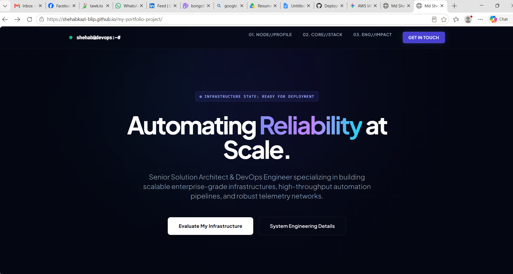

# Senior DevOps Engineer & Solution Architect Portfolio

A premium, hyper-modern, cyber-themed portfolio built using **HTML5, Tailwind CSS, and Google Fonts (Plus Jakarta Sans & Fira Code)**. This portfolio showcases production-ready DevOps infrastructure metrics, core capability stacks, and automated pipeline implementations specifically tailored for senior engineering profiles.

---

## 🚀 Live Production Environment

The system infrastructure is fully deployed and accessible via the global edge node:
🔗 **Live Link:** [https://shehabkazi-blip.github.io/my-portfolio-project/](https://shehabkazi-blip.github.io/my-portfolio-project/)

### 🖥️ Portfolio Main Interface (Live Snapshot)


### 🏗️ CI/CD Architecture Flow
+---------------------------------------------------------------------------------+
|                               DEVELOPMENT PHASE                                 |
+---------------------------------------------------------------------------------+
│
[ git push ]
│
▼
+---------------------------------------------------------------------------------+
|                           GITHUB ACTIONS CI PIPELINE                            |
+---------------------------------------------------------------------------------+
|                                                                                 |
|  ├── [ Checkout Code ] ──────> Fetches latest repository state                 |
|  │                                                                              |
|  ├── [ Linting & Syntax Check ] ──> Validates HTML5 structural integrity        |
|  │                                                                              |
|  └── [ Tailwind Compilation ] ──> Optimizes production CSS utility classes      |
|                                                                                 |
+---------------------------------------------------------------------------------+
│
[ If Success ]
│
▼
+---------------------------------------------------------------------------------+
|                           PRODUCTION CD DEPLOYMENT                              |
+---------------------------------------------------------------------------------+
|                                                                                 |
|  ├── [ GitHub Pages Engine ] ──> Compiles static node structures                |
|  │                                                                              |
|  └── [ Global Edge CDN ] ──────> Distributes assets globally with low latency  |
|                                                                                 |
+---------------------------------------------------------------------------------+
│
▼
+---------------------------------------------------------------------------------+
|                          LIVE TELEMETRY & ENDPOINT                              |
+---------------------------------------------------------------------------------+
|                                                                                 |
|  └── [ shehab@devops:~# ] ──> Active Production Node Instance                   |
|                                                                                 |
+---------------------------------------------------------------------------------+
---

## ✨ Features Highlighted in This Portfolio

- **⚡ Cybernetic UI Theme:** Deep dark backgrounds (`#040712`) enriched with glowing indigo and cyan blur gradients and tech grid patterns.
- **🖥️ Terminal Custom Branding:** Embedded real-time node environment simulation with `shehab@devops:~#` active shell prompt visualization.
- **📊 Metrics Dashboard Data:** Displays concrete production metrics including:
  - **Infrastructure XP:** 10+ Years
  - **Software Eng Alignment:** 1+ Years (BongoDev Advanced Level Integration)
  - **Deployment Speed Boost:** 3x Faster
  - **Downtime Reduction Factor:** 40% Drop
- **🛠️ Technical Capability Matrix:** Categories highlighting Containerization & Orchestration (Kubernetes, Docker, Helm), Global Cloud Fabrics (AWS, GCP), Continuous Integration (GitHub Actions pipelines), and Declarative IaC (Terraform).
- **💼 Enterprise Production Implementations:** Detailed breakdown of multi-region cloud topologies and programmatic pipeline layers with server-side metadata telemetry tracking (Meta CAPI).

---

## 🚀 How to Run & Deploy Locally

### 1. Clone the Repository
```bash
git clone [https://github.com/shehabkazi-blip/my-portfolio-project.git](https://github.com/shehabkazi-blip/my-portfolio-project.git)
cd my-portfolio-project
2. Launch Local Server
Since this is a lightweight, compiled Single Page Application (SPA), you can run it directly:

VS Code: Install Live Server extension and click "Go Live".

Python 3: Run python3 -m http.server 5500 inside the root folder and go to http://127.0.0.1:5500.

🤝 Connection Gateways
LinkedIn: MD Shehab Kazi

GitHub Infrastructure: @shehabkazi-blip

Primary Endpoint: shehabkazi@gmail.com

Built with 💖 by Md Shehab Kazi. Runtime Node Engine Platform © 2026.
